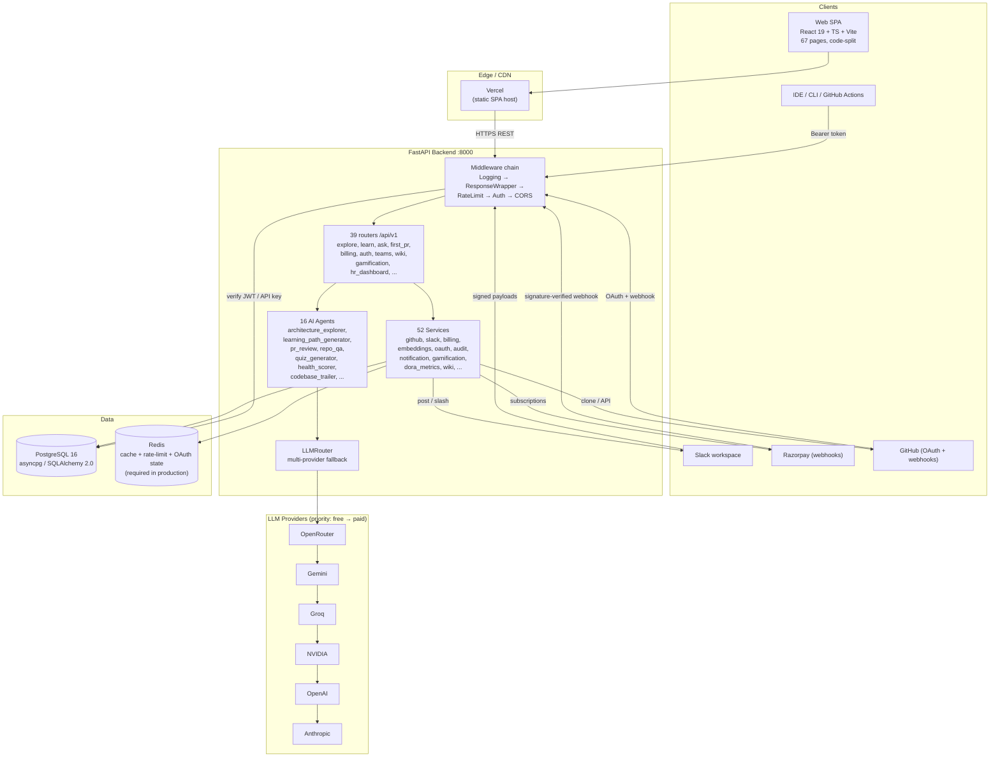
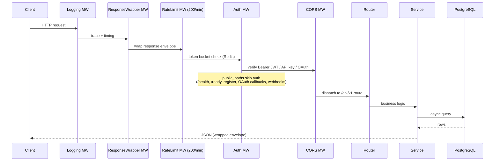
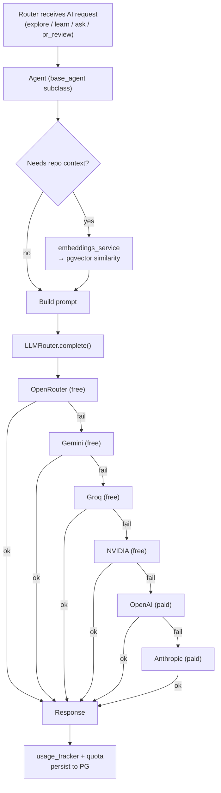
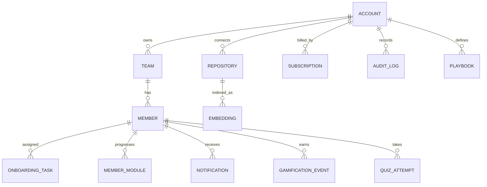
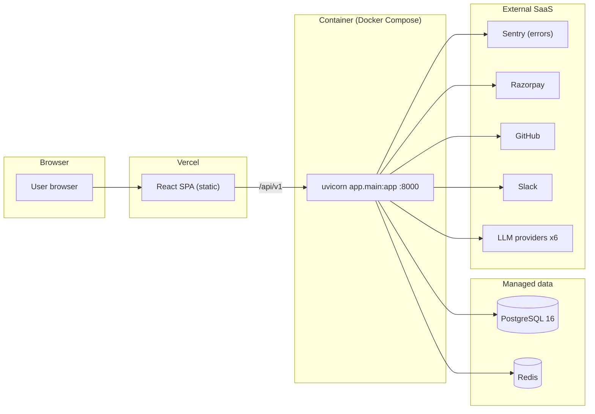

# Onramp 2.0 — Architecture & System Design (Mermaid)

Auto-generated from codebase (`backend/app/main.py`, `llm.py`, `services/`, `agents/`, `web/src/`).

---

## 1. System Architecture (C4-ish container view)

---

## 2. Request Flow (middleware pipeline)

---

## 3. AI Agent + LLM Fallback Flow

---

## 4. Domain / Data Model (high level)

---

## 5. Deployment Topology

