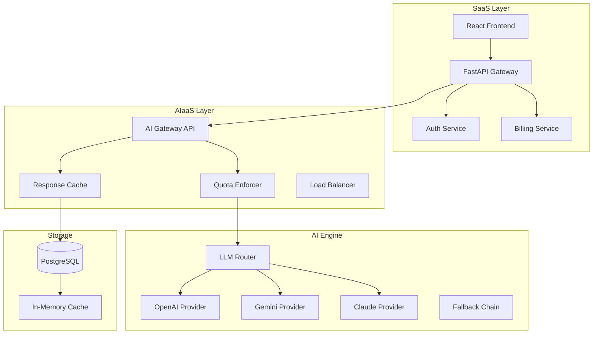

# CodeFlow 2.0 — SaaS + AIaaS Product Vision

> **Dual-mode platform: Software-as-a-Service for teams + AI-as-a-Service for developers & platforms.**

---

## Part 1: SaaS — Developer Onboarding Platform

*CodeFlow as the all-in-one platform teams subscribe to.*

### Phase 1: Core (Implemented ✓)
- [x] AI learning path generation from codebase analysis
- [x] Interactive Q&A with streaming responses & conversation memory
- [x] Architecture exploration & dependency mapping
- [x] First PR acceleration (issue finder + step-by-step guides)
- [x] Team analytics dashboard
- [x] Playbooks library (institutional knowledge capture)
- [x] PR review agent with structured analysis
- [x] Conversation history sidebar with session grouping
- [x] Quota enforcement & tier-based billing
- [x] Streaming API with multi-provider LLM fallback

### Phase 2: Engagement (In Progress)
- [ ] **Interactive Repo Visualization** — Force-directed graph of codebase dependencies with search, filter, and drill-down
- [ ] **"Senior Dev Roast" Mode** — Sarcastic codebase critique mode for the Q&A agent
- [ ] **AI PR Description Generator** — Auto-generate PR summaries from diffs
- [ ] **Knowledge Quizzes** — AI-generated multiple-choice questions from codebase
- [ ] **Gamification System** — XP points, badges, streaks for onboarding progress
- [ ] **Onboarding Progress Dashboard** — Per-developer progress, time-to-first-PR tracking
- [ ] **Weekly Digest** — Auto-generated team learning summary email

### Phase 3: Enterprise
- [ ] SSO/SAML (Okta, Azure AD)
- [ ] SOC 2 compliance reporting
- [ ] Custom onboarding templates
- [ ] Role-based access control (RBAC)
- [ ] Audit trails for compliance

### Phase 4: Platform
- [ ] Playbook marketplace (community-contributed templates)
- [ ] Certified training programs
- [ ] Industry-specific solutions (FinTech, HealthTech)
- [ ] Mobile companion app

---

## Part 2: AIaaS — AI-as-a-Service APIs

*CodeFlow's AI capabilities packaged as APIs for other products to consume.*

### 🧠 Knowledge API

```
POST /api/v1/ai/knowledge/query     — Query a codebase (context-aware RAG)
POST /api/v1/ai/knowledge/index     — Index a repository for knowledge retrieval
POST /api/v1/ai/knowledge/stream    — Streaming query with SSE
GET  /api/v1/ai/knowledge/history   — Conversation history
```

### 📚 Learning API

```
POST /api/v1/ai/learn/path          — Generate learning path from repo structure
POST /api/v1/ai/learn/quiz          — Generate quiz questions from codebase
POST /api/v1/ai/learn/progress      — Track learning progress
```

### 🔍 Review API

```
POST /api/v1/ai/review/pr           — Review a pull request diff
POST /api/v1/ai/review/code         — Review code snippet
POST /api/v1/ai/review/dependencies — Check dependency health
POST /api/v1/ai/review/security     — Security audit scan
```

### 📊 Analytics API

```
POST /api/v1/ai/analytics/architecture    — Analyze repo architecture
POST /api/v1/ai/analytics/tech-debt      — Estimate technical debt
POST /api/v1/ai/analytics/onboarding-roi — Calculate onboarding ROI
```

### 🎯 Pricing Model

| Tier | SaaS (monthly) | AIaaS (per-request) |
|------|----------------|---------------------|
| **Free** | 1 repo, 500 credits | 100 queries/day |
| **Startup** | $49/mo, 10 repos, 5K credits | $0.001/query |
| **Professional** | $299/mo, 50 repos, 50K credits | $0.0005/query (volume) |
| **Enterprise** | Custom | Custom |

---

## Part 3: Viral Demo Features

*Features designed to be recorded, shared, and talked about.*

### 🔥 "Roast My Code" (Viral)
Toggle in the Q&A chat that makes the AI respond with brutal, sarcastic but *accurate* code criticism. Users record the roast and share it. *Built on existing streaming Q&A infrastructure.*

### 🏆 DevScore Leaderboard
Each team member gets a score based on:
- Learning path completion (+50 XP per module)
- Quiz scores (+10 XP per correct answer)
- First PR merged (+200 XP)
- Questions asked (+5 XP)
- Playbooks contributed (+100 XP)

Weekly top scorer gets a crown badge. *Addictive competition loop.*

### 📺 Codebase Trailer
Auto-generate a 30-second "trailer" for the codebase:
```
"IN A WORLD... where no one understands the legacy code..."
"ONE TEAM... will rise to conquer the tech debt..."
"COMING SOON... CodeFlow"
```
Fun, shareable, shows off the AI's personality.

### 🎯 "Hot Take" PR Review 
The PR review agent, in addition to regular analysis, gives a one-line "hot take" on each PR:
- "This is the cleanest code I've seen all week. Have a cookie. 🍪"
- "This looks like it was written at 3 AM after three energy drinks."
- "Solid logic. The variable names suggest you hate your future self though."

---

## Part 4: Technical Architecture (AIaaS Layer)



---

## Implementation Priority Matrix

| Feature | Impact | Effort | Priority |
|---------|--------|--------|----------|
| 🗺️ Repo Visualization | High | Medium | P0 |
| 🔥 Roast Mode | High | Low | P0 |
| 📝 PR Description Generator | Medium | Low | P1 |
| 🏆 DevScore Leaderboard | Medium | Medium | P1 |
| 📺 Codebase Trailer | Medium | Low | P2 |
| 📊 AIaaS API Gateway | High | High | P2 |
| 📧 Weekly Digest | Low | Medium | P3 |

---

*Last updated: June 2026*
