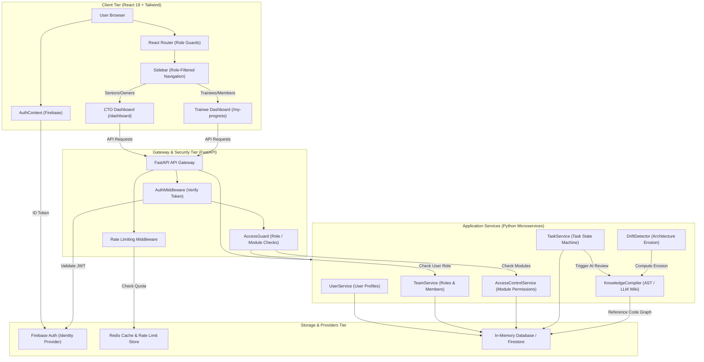
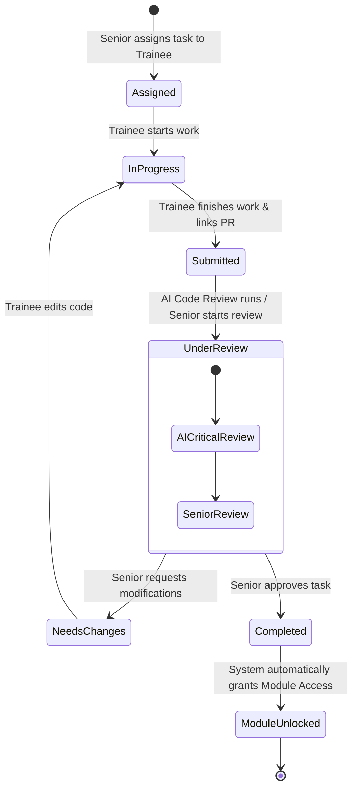

# CodeFlow 2.0 — System Architecture & Role-Based Access Control (RBAC) Design

This document details the system design, access control flow, data models, and front-to-back architecture of CodeFlow 2.0 (CodeGenome) to satisfy the requirements for senior and trainee developers.

---

## 1. Role-Based Access Control (RBAC) Matrix

The system enforces a tiered hierarchy where users are assigned roles within a team.

| Role | Access Level | Permitted Actions | Frontend Views | Backend Guard |
| :--- | :--- | :--- | :--- | :--- |
| **Owner** | Level 3 | Complete team management, change billing tiers, delete playbooks, grant/revoke module access, manage API keys, assign/review tasks, view CTO analytics. | All routes (including `/dashboard`, `/team`, `/billing`, `/api-keys`, `/playbooks`). | `require_minimum_role("owner")` or `require_minimum_role("senior")` |
| **Senior / Lead** | Level 2 | View CTO analytics, assign tasks, review submitted tasks, approve/reject task completions, configure playbooks. Cannot change billing tiers or delete teams. | `/dashboard`, `/team` (read-only settings), `/playbooks`, `/tasks` (reviewer controls). | `require_minimum_role("senior")` |
| **Member / Trainee** | Level 1 | View `/my-progress`, complete assigned tasks, submit tasks for review (link PRs), unlock codebase modules by completing tasks, ask repository questions, view learning paths. | `/my-progress`, `/explore`, `/learn`, `/ask`, `/tasks` (assignee controls), `/first-issue`. | `require_minimum_role("member")` |

---

## 2. Complete System Architecture

Here is the flow of a user session, highlighting role-based routing, middleware checks, microservices execution, and database integration.



---

## 3. Core Task Lifecycle & Module Unlocking

The system uses tasks to gate code understanding and module access for junior developers.



---

## 4. Front-to-Back Data Mappings

### 4.1. User Role Data Structure
Stored per team membership to allow a single user to be a Senior in Team A and a Member in Team B:
```json
{
  "team_id": "team_12938a",
  "user_id": "user_firebase_uid_987",
  "role": "senior", // "owner" | "senior" | "member"
  "joined_at": "2026-06-20T10:00:00Z"
}
```

### 4.2. Module Access Data Structure
Represents specific modules in the codebase unlocked by a trainee:
```json
{
  "permission_id": "perm_8f3a2b",
  "team_id": "team_12938a",
  "user_id": "user_firebase_uid_987",
  "module": "payment-gateway",
  "granted_at": "2026-06-21T01:30:00Z",
  "granted_by": "user_firebase_uid_111", // Senior ID who approved
  "source": "task_completion" // "task_completion" or "manual"
}
```

---

## 5. Front-End Design Plan for Role Gating

To integrate this plan clean and secure in the frontend, the following changes are planned:

### 1. Unified Auth-Team Hook
Create a hook `useTeamAuth` that combines the Firebase Auth State with the active team selection and roles:
```typescript
export function useTeamAuth() {
  const { user } = useAuth();
  const [role, setRole] = useState<'owner' | 'senior' | 'member' | null>(null);
  const [activeTeam, setActiveTeam] = useState<string | null>(null);
  
  // Logic to load user's teams, default to first team, and resolve active role...
  return { user, role, activeTeam };
}
```

### 2. Route Guarding (`/web/src/components/auth/RoleGuard.tsx`)
Create a route guard component that blocks non-authorized users and navigates them back to their primary page.

### 3. Dynamic Menu Filtering (`/web/src/components/ui/Sidebar.tsx`)
Filter navigation links so trainees never see links to billing, playbooks, API keys, or senior analytics, maintaining a clean workspace.
